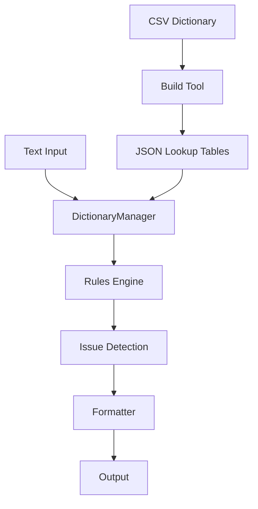

# TWLint 開發者使用手冊

> **Linus Torvalds 品味標準**的專業技術文件 - 專為開發者、貢獻者、技術寫作者設計

## 🎯 專案概覽

TWLint 是一款**去中國化專用工具**，採用 TypeScript + Node.js 架構，專門檢測並修正繁體中文文件中的簡體字和大陸用語，確保台灣技術文件的本土化和純正性。

### 核心設計理念
- **"好品味" (Good Taste)**：消除特殊情況，統一抽象層
- **Never Break Terminal**：絕不破壞現有工作流程
- **實用主義**：解決真實問題，不過度設計
- **簡潔執念**：避免超過 3 層縮進的複雜邏輯

## 🏗️ 技術架構

### 目錄結構
```
src/
├── cli.ts                    # CLI 主入口點
├── core/                     # 核心檢測引擎
│   ├── linter.ts            # 主要檢測邏輯
│   ├── config-loader.ts     # 配置載入器
│   ├── dictionary-manager.ts # 詞庫管理器
│   ├── lru-cache.ts         # LRU 快取實現
│   └── rules/               # 檢測規則
│       ├── mainland-terms.ts
│       ├── simplified-chars.ts
│       └── context-sensitive.ts
├── dictionaries/            # 編譯後詞庫 (JSON)
│   ├── core.json           # 核心詞庫 (150 詞條)
│   ├── ai-emerging-tech.json # AI 新興技術 (108 詞條)
│   ├── business-finance.json # 商業金融 (123 詞條)
│   ├── software-development.json # 軟體開發 (139 詞條)
│   └── index.json          # 詞庫索引
├── formatters/              # 輸出格式器
│   ├── stylish.ts          # 類似 ESLint 的格式
│   ├── json.ts             # JSON 格式輸出
│   └── summary.ts          # 摘要格式
└── utils/                   # 工具函數
    ├── file-utils.ts
    ├── error-utils.ts
    └── text-utils.ts

tools/                       # 建構工具
├── build-dict.ts           # 詞庫建構工具
├── validate-dict.ts        # 詞庫驗證
└── dict-manager.ts         # 詞庫管理 CLI

dictionaries-csv/           # 原始詞庫 (CSV 格式)
├── core/                   # 核心詞庫來源
├── domains/                # 領域專門詞庫
│   ├── ai-emerging-tech.csv
│   ├── business-finance.csv
│   └── software-development.csv
└── extended/               # 擴展詞庫

tests/                      # 測試檔案
├── unit/                   # 單元測試
├── integration/            # 整合測試
└── fixtures/               # 測試資料
```

### 核心數據流



## 🚀 開發環境設定

### 環境需求
- **Node.js 18+**
- **TypeScript 5.0+**
- **npm** 或 **yarn**

### 初始設定
```bash
# 1. 複製專案
git clone https://github.com/HCYT/twlint.git
cd twlint

# 2. 安裝依賴
npm install

# 3. 建構詞庫
npm run dict:build

# 4. 建構專案
npm run build

# 5. 執行測試
npm test
```

### 開發工作流程
```bash
# 開發模式（即時編譯 + 監控）
npm run dev

# 運行特定測試
npm test -- tests/unit/linter.test.ts

# 詞庫驗證
npm run dict:validate

# 類型檢查
npx tsc --noEmit

# 手動測試 CLI
npm run dev -- check README.md
npm run dev -- check README.md --fix
```

## 🧠 核心模組解析

### 1. Linter 引擎 (`src/core/linter.ts`)

**職責**：統籌檢測流程，協調各個模組

```typescript
export class TWLinter {
  private dictManager: DictionaryManager
  private rules = new Map<string, Rule>()
  private config: TWLintConfig

  // 主要檢測介面
  async lintFiles(patterns: string[]): Promise<LintResult[]>
  async lintText(text: string, filePath?: string): Promise<Issue[]>
  async fixText(text: string): Promise<string>
}
```

**關鍵設計決策**：
- **統一檔案處理**：明確檔案路徑直接傳遞，模式匹配使用 glob
- **遵循 .gitignore**：自動解析並排除不需要的檔案
- **規則引擎**：可插拔的規則架構，支援預處理

### 2. 詞庫管理器 (`src/core/dictionary-manager.ts`)

**職責**：高效的詞庫載入、查找和快取管理

```typescript
export class DictionaryManager {
  private cache = new LRUCache<string, CompiledDict>(20)

  async loadDictionary(name: string): Promise<CompiledDict>
  findMatches(text: string): MatchResult[]
  getIgnorePatterns(): Promise<string[]>
}
```

**效能最佳化**：
- **LRU 快取**：防止記憶體洩漏，限制快取大小
- **策略模式**：支援不同的匹配策略（精確、模糊、語境敏感）
- **位置去重**：避免同一位置的重複匹配

### 3. 規則系統 (`src/core/rules/`)

**設計原則**：統一介面，可插拔架構

```typescript
export interface Rule {
  name: string
  preprocess?(text: string): Promise<TextProcessingContext>
  check(text: string): Promise<Issue[]>
  fix?(text: string): Promise<string>
}
```

**實際規則**：
- **simplified-chars**：簡體字檢測，使用 OpenCC 引擎
- **mainland-terms**：大陸用語檢測，基於詞庫匹配
- **context-sensitive**：語境敏感詞檢測（未來擴展）

## 📚 詞庫系統

### 詞庫架構設計

```
詞庫分層架構：
├── 核心層 (core)：150 詞條，必載
├── 領域層 (domains)：8 個專門領域，按需載入
│   ├── software-development (139)
│   ├── user-interface (119)
│   ├── network-cloud (113)
│   ├── business-finance (123)
│   ├── social-media (106)
│   ├── operating-system (101)
│   ├── hardware-3c (91)
│   └── ai-emerging-tech (108)
└── 擴展層 (extended)：特殊用途詞庫
```

### 詞庫建構流程

```bash
# 1. CSV 來源檔案
dictionaries-csv/domains/software-development.csv

# 2. 建構工具處理
npm run dict:build
# tools/build-dict.ts 執行:
# - 讀取 CSV 檔案
# - 驗證詞條格式
# - 編譯為 JSON 查找表
# - 生成詞庫索引

# 3. 輸出 JSON 檔案
src/dictionaries/software-development.json
src/dictionaries/index.json
```

### 詞庫貢獻流程

```bash
# 1. 編輯 CSV 檔案
vim dictionaries-csv/domains/your-domain.csv

# 2. 驗證格式
npm run dict:validate

# 3. 建構詞庫
npm run dict:build

# 4. 測試
npm test

# 5. 提交變更
git add . && git commit -m "feat(dict): add new domain dictionary"
```

## 🧪 測試策略

### 測試結構
```
tests/
├── unit/                   # 單元測試
│   ├── linter.test.ts
│   ├── dictionary-manager.test.ts
│   └── rules/
├── integration/            # 整合測試
│   └── cli.test.ts
└── fixtures/               # 測試資料
    ├── sample-simplified.md
    └── sample-traditional.md
```

### 測試原則
- **48 個測試全覆蓋**：確保所有核心功能正常
- **真實資料測試**：使用實際的中文文件進行測試
- **錯誤情況覆蓋**：檔案不存在、權限錯誤等邊界情況
- **效能驗證**：大文件處理、記憶體使用等

### 執行測試
```bash
# 執行所有測試
npm test

# 單一測試檔案
npm test -- tests/unit/linter.test.ts

# 監控模式
npm test -- --watch

# 覆蓋率報告
npm test -- --coverage
```

## 🔧 常用開發任務

### 新增檢測規則

1. **建立規則檔案**
```typescript
// src/core/rules/your-rule.ts
export class YourRule implements Rule {
  name = 'your-rule'

  async check(text: string): Promise<Issue[]> {
    // 檢測邏輯
  }

  async fix(text: string): Promise<string> {
    // 修復邏輯
  }
}
```

2. **註冊規則**
```typescript
// src/core/linter.ts
import { YourRule } from './rules/your-rule.js'

constructor() {
  this.rules.set('your-rule', new YourRule())
}
```

3. **添加測試**
```typescript
// tests/unit/rules/your-rule.test.ts
describe('YourRule', () => {
  it('should detect issues', async () => {
    // 測試邏輯
  })
})
```

### 新增詞庫領域

1. **建立 CSV 檔案**
```csv
# dictionaries-csv/domains/new-domain.csv
china_simplified,taiwan,confidence,category,reason,match_type,context,autofix_safe
新词,新詞,0.95,terminology,專業術語,exact,,true
```

2. **更新建構工具**
```typescript
// tools/build-dict.ts 會自動偵測新的 CSV 檔案
```

3. **測試新詞庫**
```bash
npm run dict:build
npm run dict:validate
npm test
```

### 新增輸出格式器

1. **實作格式器介面**
```typescript
// src/formatters/your-formatter.ts
export class YourFormatter implements Formatter {
  format(results: LintResult[]): string {
    // 格式化邏輯
  }
}
```

2. **註冊格式器**
```typescript
// src/cli.ts
const formatters = {
  stylish: StylishFormatter,
  json: JsonFormatter,
  your: YourFormatter
}
```

## 🐛 偵錯指南

### 常見問題與解決

**1. 詞庫載入失敗**
```bash
# 檢查詞庫是否正確建構
npm run dict:build
npm run dict:validate

# 檢查檔案權限
ls -la src/dictionaries/
```

**2. 測試失敗**
```bash
# 清理並重建
npm run clean
npm run build
npm test
```

**3. TypeScript 編譯錯誤**
```bash
# 檢查類型定義
npx tsc --noEmit
```

**4. 記憶體使用過高**
```bash
# 檢查 LRU 快取設定
# src/core/dictionary-manager.ts 中的快取大小
```

### 效能分析
```bash
# 使用 Node.js 內建 profiler
node --prof dist/cli.js check large-file.md

# 記憶體使用分析
node --inspect dist/cli.js check large-file.md
```

## 📦 發佈流程

### 版本發佈檢查清單

```bash
# 1. 確保所有測試通過
npm test

# 2. 建構專案
npm run build

# 3. 驗證詞庫
npm run dict:validate

# 4. 更新版本號
npm version patch|minor|major

# 5. 發佈到 npm
npm publish

# 6. 建立 Git tag
git tag -a v1.x.x -m "Release v1.x.x"
git push origin --tags
```

### CI/CD 整合

```yaml
# .github/workflows/test.yml
name: Test
on: [push, pull_request]
jobs:
  test:
    runs-on: ubuntu-latest
    steps:
      - uses: actions/checkout@v3
      - name: Setup Node.js
        uses: actions/setup-node@v3
        with:
          node-version: 18
      - name: Install dependencies
        run: npm install
      - name: Build dictionaries
        run: npm run dict:build
      - name: Run tests
        run: npm test
      - name: Build project
        run: npm run build
```

## 🤝 貢獻指南

### 程式碼品質標準

**遵循 Linus Torvalds 的"好品味"原則**：

✅ **好品味範例**
```typescript
// 統一的錯誤處理
const handlers = {
  'file-not-found': () => handleFileNotFound(),
  'permission-denied': () => handlePermissionDenied(),
  'unknown-error': () => handleUnknownError()
}
handlers[errorType]?.() || handleDefault()
```

❌ **垃圾範例**
```typescript
// 特殊情況處理
if (errorType === 'file-not-found') {
  handleFileNotFound()
} else if (errorType === 'permission-denied') {
  handlePermissionDenied()
} else if (errorType === 'unknown-error') {
  handleUnknownError()
} else {
  handleDefault()
}
```

### Pull Request 流程

1. **Fork 專案**
2. **建立功能分支**：`git checkout -b feature/your-feature`
3. **遵循程式碼風格**：避免 `any` 類型，消除特殊情況
4. **撰寫測試**：確保新功能有對應測試
5. **通過所有測試**：`npm test` 必須 100% 通過
6. **提交 PR**：詳細描述變更內容

### 程式碼審查標準

- ✅ **類型安全**：禁用 `any`，明確類型定義
- ✅ **錯誤處理**：統一的錯誤處理策略
- ✅ **效能考量**：適當的快取和記憶體管理
- ✅ **測試覆蓋**：新功能必須有對應測試
- ✅ **文件更新**：API 變更需要更新文件

## 📞 技術支援

### 開發者資源
- **GitHub Issues**：https://github.com/HCYT/twlint/issues
- **技術討論**：GitHub Discussions
- **程式碼審查**：Pull Request 流程

### 聯絡方式
- **專案維護者**：Huang Chung YI
- **Email**：透過 GitHub Issues
- **文件貢獻**：歡迎 PR 改善文件

---

**讓我們一起建構台灣技術界最專業的去中國化工具！**

> *"Talk is cheap. Show me the code."* - Linus Torvalds